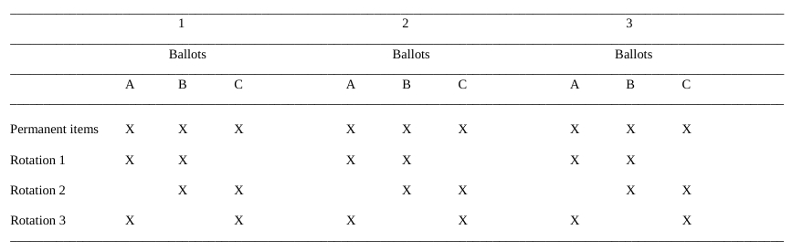
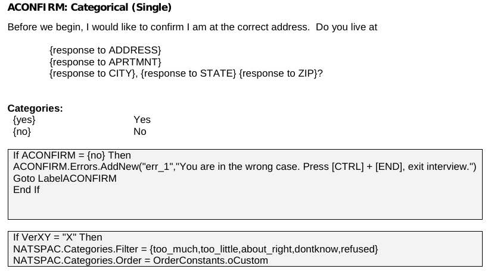
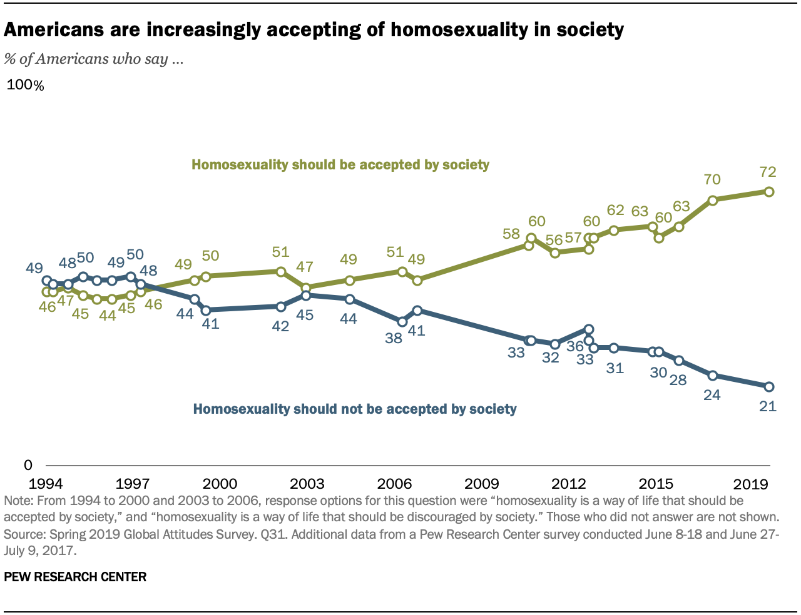

## Setup

### Load packages

```{r load-packages, message = FALSE}
library(ggplot2)
library(dplyr)
library(statsr)
library(tidyr)
library(knitr)
library(tidyverse)
```

### Load data

```{r load-data}
load("gss.Rdata")
```


* * *

## Part 1: Data

The General Social Survey (GSS) by NORC at the University of Chicago claims to be a comprehensive, unbiased perspective on American opinion on contemporary issues and trends ^[[About the GSS](http://gss.norc.org/About-The-GSS)]. The survey ensued in 1972 and continues to date while trying to improve and ameliorate bias with each iteration. The GSS has employed a biennial, dual sample design since 1994, i.e., the GSS conducts the survey in even years with two samples.

### Study Design

The GSS, since its inception, has been using a rotation scheme as a means to alleviate bias introduced due to question order. The intrinsic ordering of questions can have a primacy and recency effect, which distort response behavior. ^[[Rotating Panel Design - Encyclopedia of Survey Research Methods](https://methods.sagepub.com/reference/encyclopedia-of-survey-research-methods/n500.xml)] From a statistical standpoint, rotation is advantageous when data needs to be aggregated. In retrospect, rotation doesn't work when a correlation analysis needs to be conducted. The recency effect will be more apparent as participants will tend to associate newer options with the presented scale. ^[[Rotation - SoSci Survey](https://www.soscisurvey.de/help/doku.php/en:create:rotation)]

The rotation scheme also allows the survey to include "Permanent items" and "Regular items" as each set of items only appeared two-thirds of the time. A noted disadvantage of this approach was that it results in gaps (or NAs) in the data. However, the impact of such gaps can be reduced during aggregation. 

The rotation, the across-time design was discontinued in 1987 as it causes an imbalance in the time-series. According to GSS Appendix Q^[[GSS Codebook: Appendix Q](https://gss.norc.org/documents/codebook/GSS_Codebook_AppendixQ.pdf)], "a split-ballot design was introduced, which splits the rotations "across random ballots (or sub-samples) within each survey rather than across surveys (and years)." Figure 1 shows how split-ballot rotation took place, starting in 1988.



### Sampling design

According to Appendix A^[[GSS Codebook: Appendix A](https://gss.norc.org/documents/codebook/GSS_Codebook_AppendixA.pdf)], survey samples through 1972 to 1974 followed a modified probability sample which was then conducted alongside a full probability sample design for 1975 to 1977 surveys. The variable `sample` denotes this separation. The appendix also states, "investigators who have applied statistical tests to previous General Social Survey data should continue to apply those tests." For simplicity in this project, we will assume a random sample for years 1972 through 1977. Finally, the years 1977 and above used a full probability sample rather than this transition methodology, making it safe to assume a random sample.

### Causality

Since there is no random assignment, blocking, or control involved, the study can only be deemed as observation (as opposed to an experiment). Since there is no guarantee that all confounding variables can be examined or measured in an observational study, no causal relationship can be established.

### Generalizability

The survey was only conducted in English till 2006, any statistics involving non-English speaking participants until 2006 should note this. Furthermore, the survey was conducted in Spanish in addition to English speakers, which is said to include "60-65%" of the language exclusions. 

The sample is conducted as a multi-stage sample with further block quotas. Each block constitutes of a quota based on sex, age, and employment status. To reduce the bias introduced by "not-at-home" cases, interviewers are instructed to interview only after 1500 hrs on weekdays or during weekends and/or holidays. The timings are based on empirical evidence from previous surveys.

The primary sampling units are Standard Metropolitan Statistical Areas and counties, which are again stratified by race, region, and age. Within these primary sampling units, blocks were selected with probabilities proportional to size. Furthermore, interviewers have been advised to start from the northwest corner of the block and continue until the block's quota has been met. 

According to Appendix B ^[[GSS Codebook: Appendix B](https://gss.norc.org/documents/codebook/GSS_Codebook_AppendixB.pdf)], all interviews are trained by area supervisors to minimize bias. Appendix B also includes a holistic list of specifications to be followed by an interviewer. GSS also documents their survey programming and also includes instructions on handling unusual cases. ^[[List of GSS questionnaires](http://gss.norc.org/Get-Documentation/questionnaires)]. Figure 2 shows an example of a response.



* * *

## Part 2: Research question

A rise in support in same-sex marriages has changed the attitudes, and laws countries have had on homosexuality. Prior to 2003 in the United States, same-sex sexual activity was illegal in fourteen states ^[[LGBT rights in the United States](https://en.wikipedia.org/wiki/LGBT_rights_in_the_United_States)]. On June 26, 2015, the supreme court legalized same-sex marriages in all states and required states to recognize out-of-state same-sex marriage. ^[[Same-sex marriage legislation in the United States](https://en.wikipedia.org/wiki/Same-sex_marriage_legislation_in_the_United_States)] This was in response to the landmark civil rights case, now termed as, _Obergefell v. Hodges_ ^[[Obergefell v. Hodges](https://en.wikipedia.org/wiki/Obergefell_v._Hodges)]

According to a Pew Research study^[[The Global Divide on Homosexuality Persists](https://www.pewresearch.org/global/2020/06/25/global-divide-on-homosexuality-persists/)], The United States has seen a rise of 12% in the acceptance of homosexuality from 74% in 2002 to 86% in 2019. In developing countries like India, laws against the LGBTQ community's criminalization have been revoked as of 2019. ^[[LGBT rights in India](https://en.wikipedia.org/wiki/LGBT_rights_in_India)]. Furthermore, the same Pew Research study quotes a 22% increase in the acceptance of homosexuality in India from 15% in 2002 to 37% in 2019, which is post the decriminalized period. In summary, this acceptance seems to entail any legalization or decriminalization of LGBTQ rights. 

There is an apparent trend, as shown in figure 3, in the rise of the acceptance of homosexuality in the United States, since 2015. 
However, it would be statistically incorrect to say legalization and acceptance are associated without proper evidence. Legalization may be one of the several factors that influence ones decision of homosexuality. Other influential factors may include religion, education, political status, ideologies, and so on.



Unfortunately, despite the increase in net acceptance, there seems to be a divide among members of the religious community. The same study mentions "significant differences" across highly religious and less religious countries and their acceptance of homosexuality. Religious reforms and upbringing can have an adverse impact on people who associate themselves with the LGTBQ community. Countries that define laws based on religious majority such as India (predominately Hindu) and Indonesia (primarily Muslim), can negatively affect people who identify themselves as homosexual. Therefore, it is important to understand whether religion had a significant impact on policymakers and their decision to legalize same-sex marriage. 

A research question can be drawn out as follows:

> Is there a relationship between confidence in organized religion and acceptance of homosexual sexual relations in the United States in 2002?

Before the 2015 bill, several states hadn't legalized same-sex marriage. It would be interesting to observe the association between these two categorical variables. Furthermore, according to figure 3, acceptance percentages are over 15% lower in 2003 than in 2019. Additionally, since the earliest date of enactment/ruling for the same-sex marriage law is November 18, 2003 (Massachusetts) and effective on May 17, 2004, the impact of legalization would be less apparent. However, the impact would not be entirely eradicated since any inferences will be drawn out based on observation. 

It should be noted that this project aims to understand the impact of one religious factor on acceptance of another single element of the LGBTQ community. This study will enable us to understand whether people who tend to believe more in organized religion (a structured system of faith) tend not to accept sexual relationships among members of the same sex.
 
* * *

## Part 3: Exploratory data analysis

The two variables of this project will use to address the research question are:

1. `conclerg`: confidence in organized religion
2. `homosex`: Homosexual sex relations

### `conclerg`

This variable answers the following question in the interview:

> "I am going to name some institutions in this country. As far as the people running these institutions are concerned, would you say you have a great deal of confidence, only some confidence, or hardly any confidence at all in them?"

The respondents then selects one of the following options:

| VALUE | LABEL        |
|-------|--------------|
| NA    | IAP          |
| 1     | A GREAT DEAL |
| 2     | ONLY SOME    |
| 3     | HARDLY ANY   |
| NA    | DK           |
| NA    | NA           |

These factors are labeled as 1, 2, and 3. The order or the value, in this case, doesn't impact the weightage of each option.

### `homosex`

This variable answers the following question in the interview:

> "What about sexual relations between two adults of the same sex?"

The respondents then selects one of the following options:

| VALUE | LABEL            |
|-------|------------------|
| NA    | IAP              |
| 1     | ALWAYS WRONG     |
| 2     | ALMOST ALWAYS WRG |
| 3     | SOMETIMES WRONG  |
| 4     | NOT WRONG AT ALL |
| 5     | OTHER            |
| NA    | DK               |
| NA    | NA               |

Similarly to the previous variable, these factors are labeled as 1, 2, 3, 4 and 5. The order or the value, in this case, doesn't impact the weightage of each option.

### NAs

In order to address the research question, we're not going to consider respondents who answered Inapplicable (IAP), Don't Know (DK), nor Not Applicable (NA). According to the Release Notes Panel, "could include refusing the question, giving a garbled answer, or declining the remaining questions in a given module." In this case, ignoring or dropping such values is not going to impact our analysis. Furthermore, respondents who were marked as IAP were not eligible for the question. Lastly, we can also ignore the "OTHER" factor for `homosex` as it isn't clear what this factor refers to. These rows can also be dropped without affecting our analysis adversely.

### Exploration

```{r}
# dropping rows for the data
gss_clean <- gss %>%
  filter(!is.na(homosex), !is.na(conclerg), homosex!="Other")

# finding the max and min years
summary(gss_clean$year)
```

We're going to start by taking a look at how the acceptance of homosexual sexual relations has changed over the years 1973 - 2012. For this we'll plot categories 1 - 4 as stacked bar charts. This helps us understand how the proportions of each response factor changes over the years.

```{r}
ggplot(data=gss_clean, aes(x = year, fill = homosex)) + 
  geom_bar(position="fill", na.rm = TRUE) +
  ylab("Proportions for acceptance of homosexual sexual relations") + 
  xlab("Year")
```

There seems to be a general rise in the acceptance of homosexual sexual relations. The stacked bar plot above shows an increase in the proportions of "Not Wrong At All" and decrease in the proportions of "Always Wrong". A majority of the responses for `homosex` seem to be in the extremes as the proportions of responses for "Almst Always Wrg" and "Sometimes Wrong" look much smaller. We can confirm this using a line plot of the proportions:

```{r}
homosex_year_prop <- gss_clean %>%
  group_by(homosex, year) %>%
  summarize(freq = n()) %>%
  group_by(year) %>%
  mutate(prop=freq/sum(freq))

ggplot(data=homosex_year_prop, aes(x=year, y=prop)) +
  geom_line(aes(color=homosex, linetype=homosex)) +
  ylab("Proportions for acceptance of homosexual sexual relations") + 
  xlab("Year")
```

This general increasing trend in "Always Wrong" proportions and general decrease trend in "Almst Always Wrg" proportions can be confirmed using the plot above. These continue to increase and decrease until "Not Wrong At All" proportion is higher than that of "Always Wrong". Furthermore, the acceptance of homosexuality is in line with the research conducted by the Pew Research Center mentioned in [Part 2](## Part 2: Research question) of this project.

Now, we'll take a look at how the acceptance of confidence in organized religion has changed over the years 1973 - 2012. For this, we'll plot all categories as stacked bar charts. This helps us understand how the proportions of each response category changes over the years.

```{r}
ggplot(data=gss_clean, aes(x = year, fill = conclerg)) + 
  geom_bar(position="fill", na.rm = TRUE) +
  ylab("Proportions for confidence in organization religion") + 
  xlab("Year")
```

Although not apparent, there seems to be a general decrease in the proportion responding "A Great Deal" with a substantial drop in 2003 followed by another decline in this proportion. Furthermore, there seems to be a general increase in the proportions for "Hardly Any" except the late 1980s where the proportions peaked. The "Only some" response appears to be consistent across the years. We can confirm this using a line plot of the proportions:

```{r}
conclerg_year_prop <- gss_clean %>%
  group_by(conclerg, year) %>%
  summarize(freq = n()) %>%
  group_by(year) %>%
  mutate(prop=freq/sum(freq))

ggplot(data=conclerg_year_prop, aes(x=year, y=prop)) +
  geom_line(aes(color=conclerg, linetype=conclerg)) + 
  ylab("Proportions for confidence in organization religion") + 
  xlab("Year")
```

Based on the line plot above, there seems to be no apparent trend in the "Only some" response as proportions seem to increase and decrease regardless of the passage in time. Furthermore, the general increase in "Hardly Any" proportions and a general decrease in the "A Great Deal" proportions are evident. However, "A Great Deal" constituents to a more substantial proportion of the sample.

We will now look at the year 2002 specifically, which is concerning our research question. 

```{r}
homosex_year_prop %>%
  filter(year==2002) %>%
  select(c(homosex, prop))
```

Based on the one-way contingency table above, higher proportions of people in 2002 tend to be against homosexual sexual relationships.

```{r}
conclerg_year_prop %>%
  filter(year==2002) %>%
  select(c(conclerg, prop))
```

Based on the table above, the proportions of "Hardly Any" exceed those of "A Great Deal." Furthermore, according to the line chart illustrating the change in proportions of confidence in organized religion, the year 2002 is when there's a sudden change in these proportions. 2003 and 2004 seem to show proportions where "A Great Deal" exceeds those of "Hardly Any."

Now to summarize the association, we will construct a two-way contingency table for the year 2002. The table below shows the distribution of responses by accepting homosexual sexual activity and confidence in organized religion:

```{r}
conclerg_homosex <- gss_clean %>%
  filter(year==2002) %>%
  group_by(conclerg, homosex) %>%
  summarize(freq = n()) %>%
  pivot_wider(id_cols=homosex, names_from=conclerg, values_from=freq)

conclerg_homosex <- conclerg_homosex %>% 
  remove_rownames %>% 
  column_to_rownames(var="homosex")

conclerg_homosex <- as.table(as.matrix(conclerg_homosex))
kable(conclerg_homosex)
```

```{r}
kable(prop.table(conclerg_homosex, 2))
```

The following can also be used as a stacked bar graph for comparing proportions of our response variable and explanatory variable. The stacked bar graph also shows us the proportions of the response variable with the explanatory variable. The response variable is the acceptance of homosexual sexual relations, plotted on the y-axis. On the other hand, the explanatory variable is the confidence in organized religion, plotted on the x-axis.

```{r}
ggplot(data=gss_clean %>% filter(year==2002), aes(x = conclerg, fill = homosex)) + 
  geom_bar(position="fill", na.rm = TRUE) +
  ylab("Proportions of acceptance of homosexual sexual relations") + 
  xlab("Confidence in organized religion")
```

There seems to be a more substantial proportion of people that find homosexual sexual relations "Always Wrong" for the group that has "A Great Deal" of confidence in organized religion. On the other hand, this "Always Wrong" proportion seems to be much smaller for the "Hardly Any" group.

To check if there is an association between confidence in organized religion and acceptance of homosexual sexual relations in 2002, we need to perform a hypothesis test.


* * *

## Part 4: Inference

Since we're trying to test whether the two variables are associated as mentioned in the research question, we need to perform a hypothesis test. We'll be using the chi-square test of independence, since we're evaluating the independence of two categorical variables where at least one of them has more than two levels. In our case, `homosex` has 4 levels while `conlerg` has three.

### Hypotheses

Our hypotheses can this be defined as:

$H_{0}$: The acceptance of homosexual sexual relations is independent of the confidence in organized religion in the United States in 2002. The observed difference is due to chance and they do not vary with each other.

$H_{A}$: The acceptance of homosexual sexual relations is associated with the confidence in organized religion in the United States in 2002. The observed difference is not due to chance and they vary with each other.

### Conditions for the chi-square test of independence

The following conditions need to be met for us to carry out the hypothesis test.

1. **Independence**: 
    - The data collected by GSS are random samples. 
    - Since GSS samples without replacement, the sample size is certainly less than 10% of the total population in the US.
    - Furthermore, each case only contributes to one cell in the table due to the design in the survey. Each respondant can only give one answer for each question of the questions on `conclerg` and `homosex`.
    - Thus we can say the independence criteria is satisfied.
  
Calculating expected count for the chi-square test of independence. The approach for this can be found on StackOverflow ^[[R function to get a table of expected counts](https://stackoverflow.com/questions/34214787/is-there-an-r-function-to-get-a-table-of-expected-counts)]:

```{r}
Xsq <- chisq.test(conclerg_homosex)
conclerg_homosex_exp <- conclerg_homosex 
conclerg_homosex_exp[] <- paste(conclerg_homosex, paste0("(",round(Xsq$expected),")"))
kable(conclerg_homosex_exp)
```

2. **Sample size**: Since each cell does not have at least 5 expected cases, we cannot use the chi-square test for this. Instead we'll have to use a simulation.

3. **Dof**: 
   - The degrees of freedom in this case should be greater than 2.
   - This can be calculated as follows:

$$\begin{aligned}
dof = (R-1) \times (C-1)
\end{aligned}
$$

 where,
  R is the number of rows
  C is the number of columns
  
  - $\implies dof = (4-1) \times (3-1) = 6$
  - Hence this condition is satisfied
  
### Chi-square test with simulation

```{r}
Xsq <- chisq.test(conclerg_homosex, simulate.p.value = TRUE)
```


* Talk about out of wedlock - is it married people of the same gender
* Talk about question being out of context